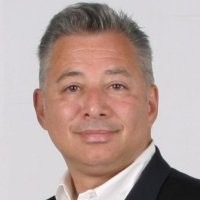
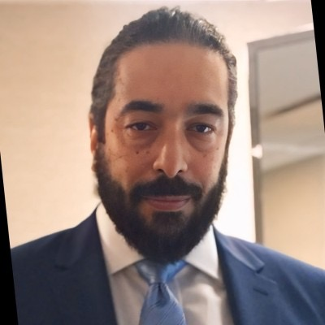

---

title: leaders
displaytext: Leaders
layout:  null
tab: true
order: 2
tags: NYC

---

## Guy Osa

-----

## Zoe Braiterman

Zoe Braiterman is an information security consultant, open source security leader, and cybersecurity advocate specializing in application security, artificial intelligence, and secure distributed systems. She hosts the weekly PurePoint International Consciously Secure Leadership Series and advises emerging cybersecurity companies on security strategy, governance, and enterprise adoption.

Her work focuses on advancing secure software and digital infrastructure through application security, AI governance, vulnerability management, and secure blockchain technologies. She is passionate about helping organizations build resilient systems that enable innovation without compromising trust.

Zoe serves as a New York Chapter Leader for OWASP and is the Project Leader for the OWASP Blockchain AppSec Standard and the OWASP Vulnerability Management Guide. She is also a co-author of the Threat Modeling Manifesto and has contributed to open source security standards, technical guidance, and community initiatives spanning application security, artificial intelligence, blockchain security, high-performance computing, and medical device cybersecurity.

A Women Economic Forum honoree and frequent international conference speaker, Zoe is dedicated to advancing cybersecurity through open source collaboration, technical excellence, mentorship, and inclusive leadership.

----

## Carlos Mena

Carlos Mena is a technology leader with more than 30 years of experience across enterprise software, cybersecurity, identity, cloud, and application infrastructure. He currently works with Curity, where he focuses on modern identity, API security, OAuth, OpenID Connect, and secure access patterns for applications, APIs, and emerging AI-driven systems.

As Event Coordinator for the OWASP NYC Chapter, Carlos helps organize programming that brings together security practitioners, engineers, architects, and technology leaders across the New York community. He is passionate about making application security education more accessible, practical, and connected to the real-world challenges teams face when securing modern software.
